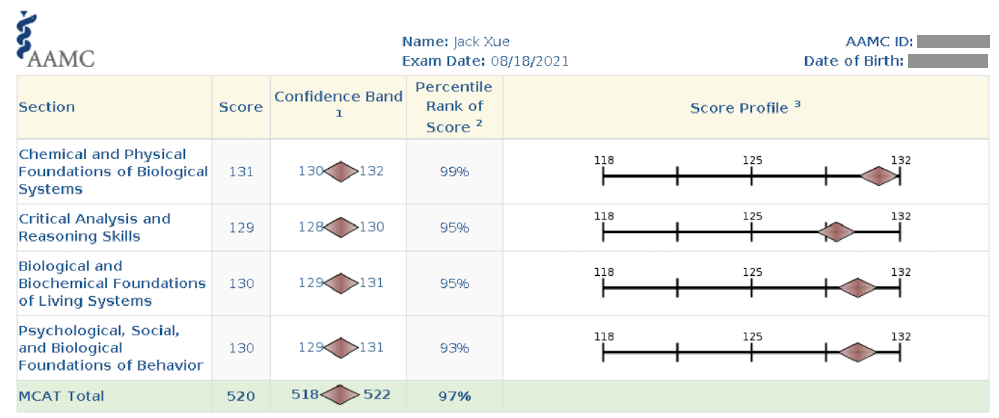
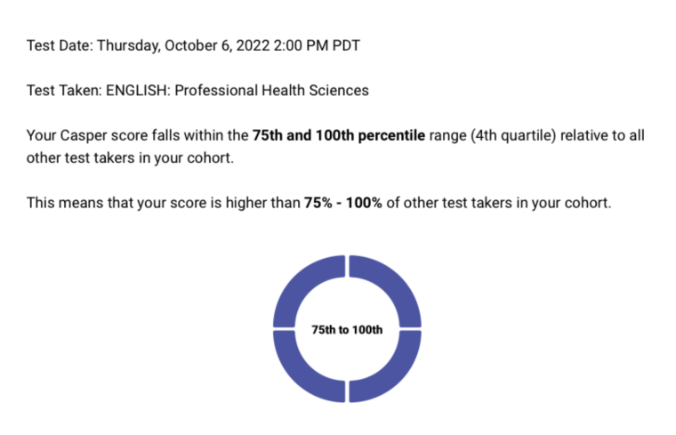
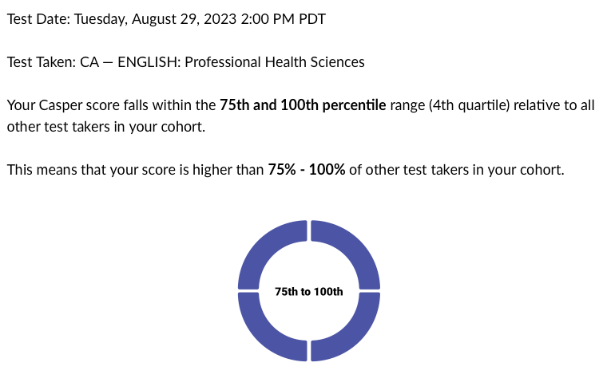

## Tutoring Services | Pre-Med

Receive advice and tutoring from a current medical student.

Available online on Zoom, Teams, or a plaform of your choice. Multi-hour bundles and asynchronous rates available upon request. Please contact for pricing and scheduling.



## MCAT
The Medical College Admission Test (MCAT) is a standardized multiple-choice test used to assess prospective medical students in problem-solving, critical thinking, and scientific knowledge.

Available services include:
- One-on-one tutoring to boost your MCAT score
- Develop a personalized study planning
- Recommendations on content resources and practice materials
- Content review
- Test taking and practice





## Casper
The Casper test is a yearly typed- and video-response test required for several Canadian medical schools. Scoring in the 4th quartile will ensure your application is competitive.

Available services include:
- Approach to scenarios and questions
- Planning and test-taking tips
- Live or asynchronous answer evaluation


|  |  |
|-------------------------------------------------------|-------------------------------------------------------|


## Application Review
Every medical school has different requirements and application processes. Simplify the application cycle.

Available services include:
- Application planning (incl. deadlines, requirements, and extra-cirriculars)
- Autobiographical sketches and extracirriculars planning

## Interview Preparation
All Canadian medical schools have some form of applicant interviewing. The most common are the multiple mini interview (MMI) and panel interview.

Available services include:
- Preparing for interviews
- Practice MMI

Disclaimer: due to university policy, confidential information regarding the admissions process are not disclosed in interview preparation sessions.